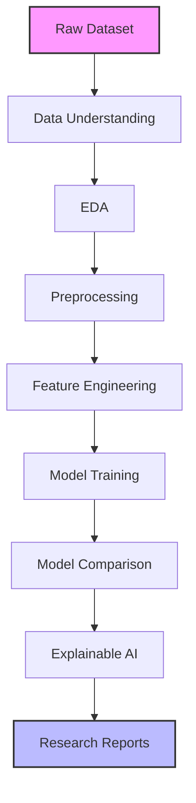
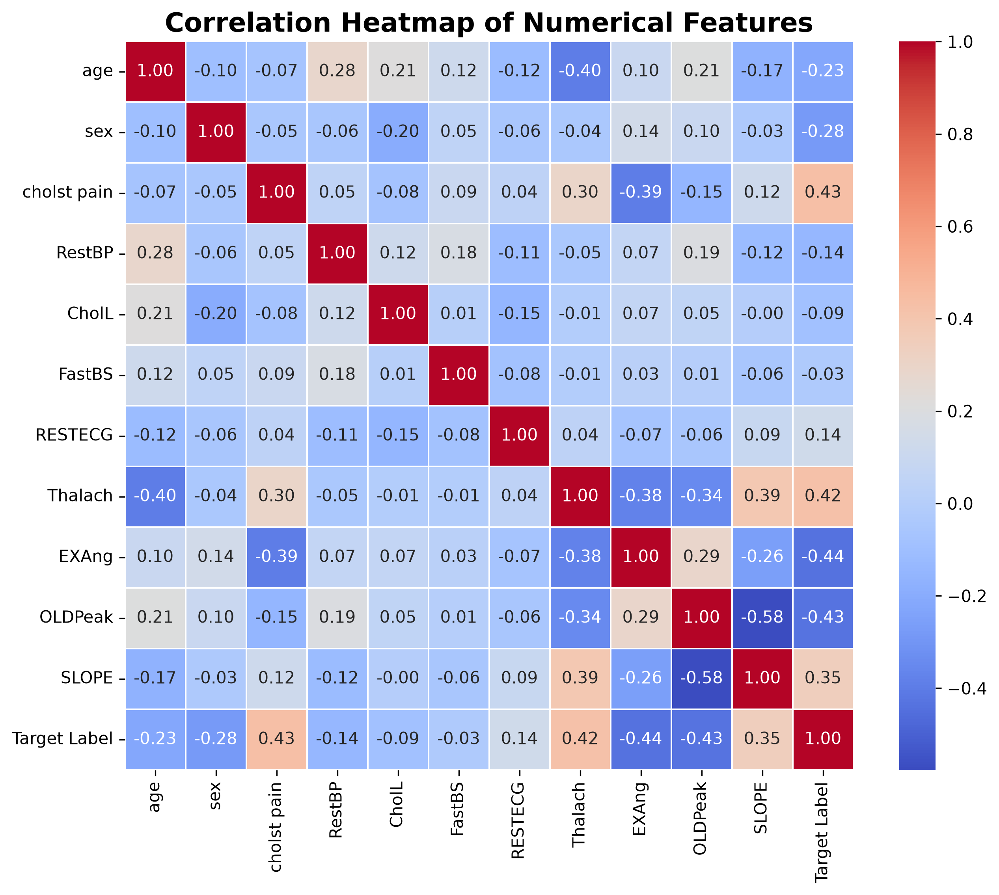
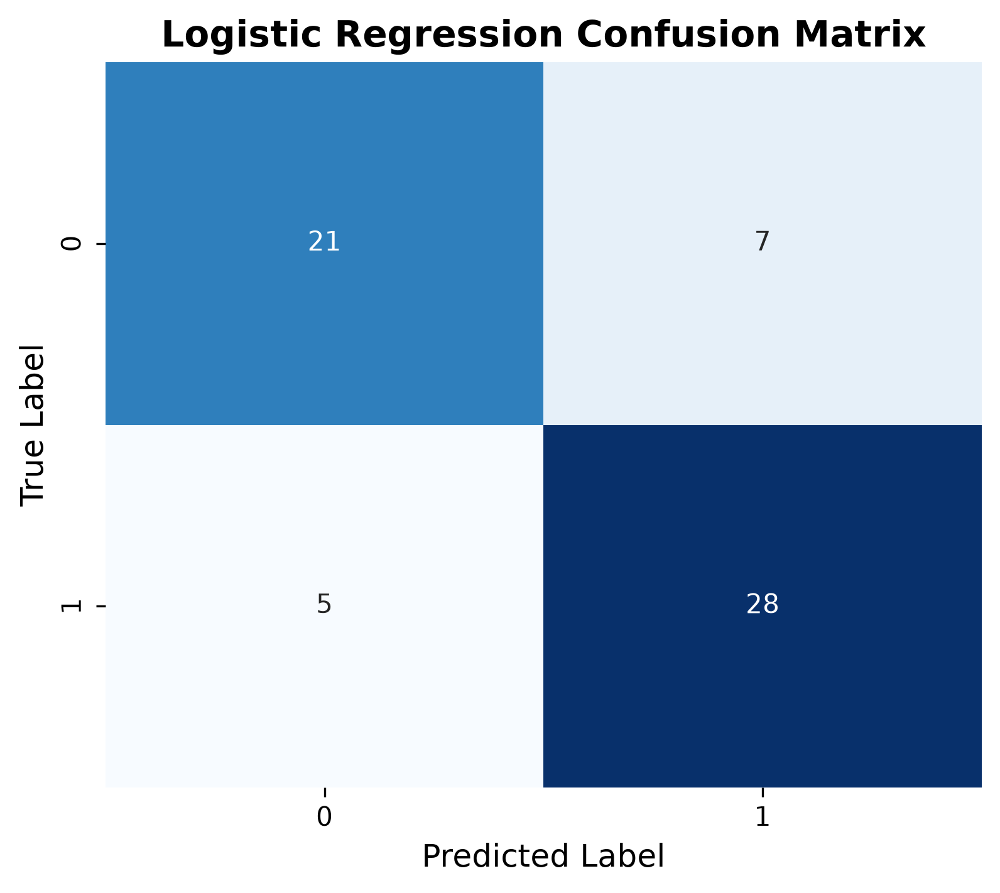
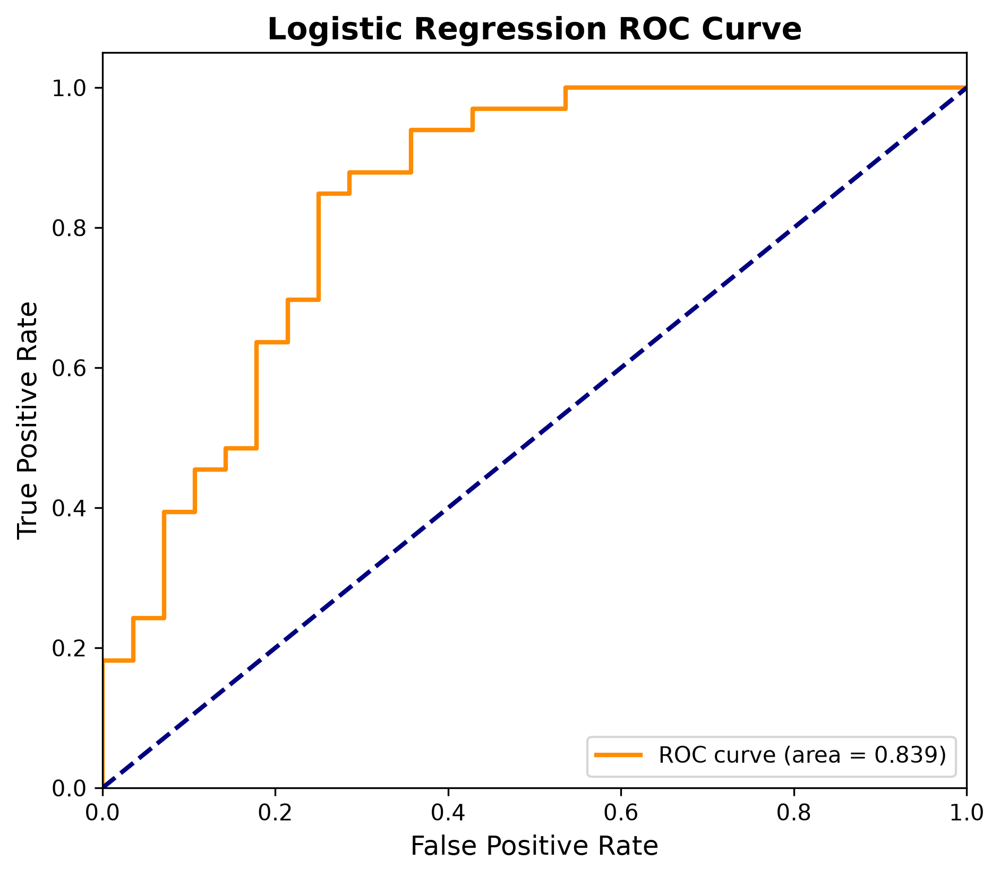
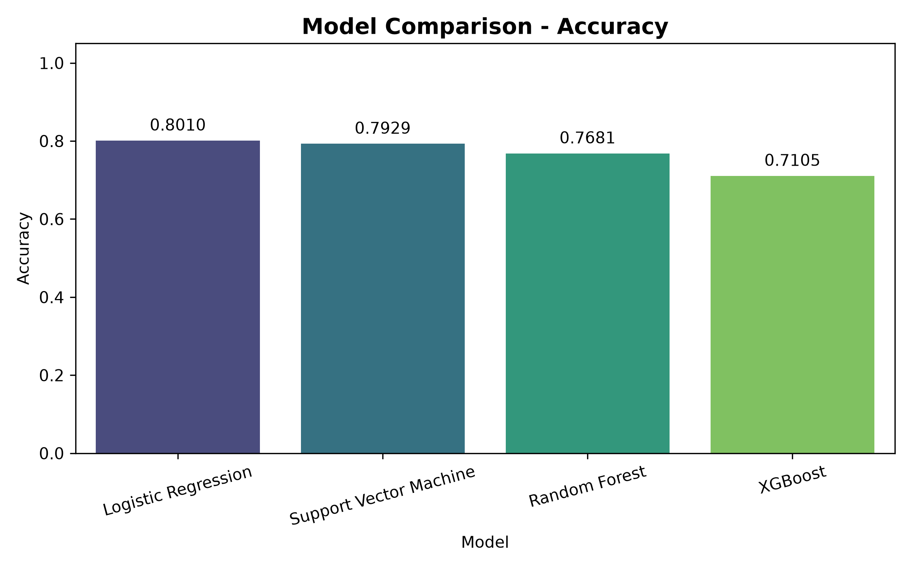
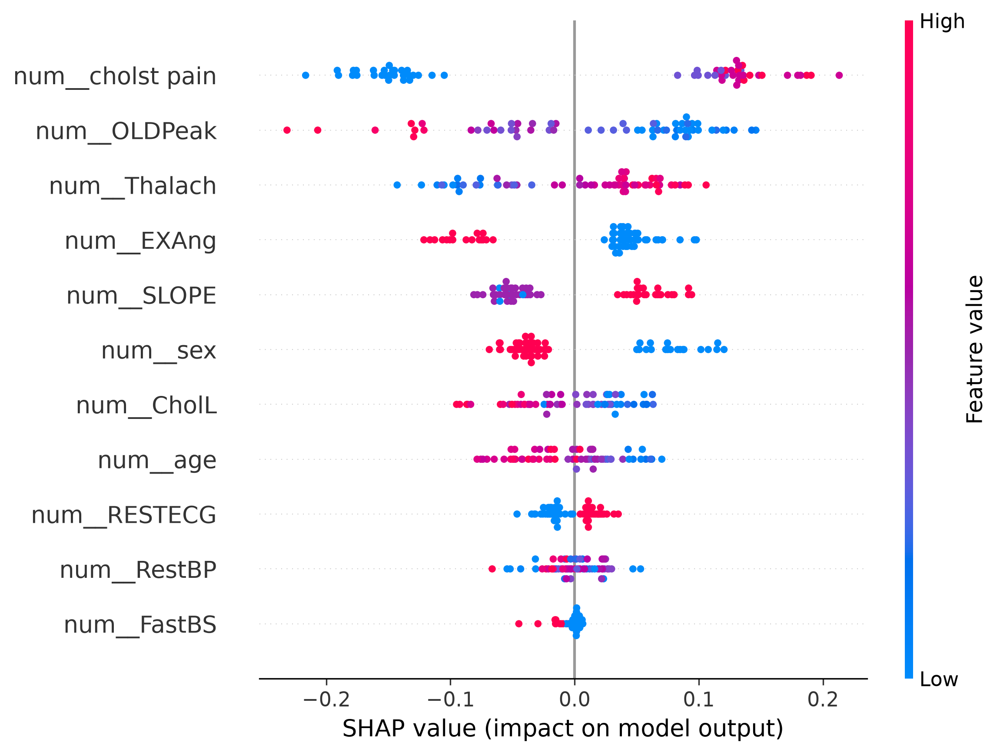

<div align="center">

# ❤️ Heart Disease Prediction using Machine Learning

### *Research-Grade End-to-End Machine Learning Pipeline with Explainable AI*

[](https://www.python.org/)
[](https://scikit-learn.org/)
[](https://xgboost.readthedocs.io/)
[](https://shap.readthedocs.io/)
[](https://pandas.pydata.org/)
[](https://numpy.org/)
[](https://matplotlib.org/)
[](LICENSE)
[]()
[]()

<p align="center">
  <strong>Data Analysis • Feature Engineering • Comparative Evaluation • Explainable AI • Research Documentation</strong>
</p>

</div>

---

## 📖 Project Overview
This repository contains a full-stack, research-grade Machine Learning pipeline designed to predict the presence of heart disease accurately. The project is highly motivated by the critical need for robust, interpretable diagnostic tools in modern healthcare.

Our primary objective was to build a comprehensive pipeline that goes beyond standard predictive modeling. By utilizing a clinical dataset, we conducted rigorous Exploratory Data Analysis (EDA) and robust feature engineering. The core research methodology systematically compares four distinct Machine Learning architectures against a strict hold-out validation set and 5-Fold Stratified Cross-Validation.

Finally, because black-box models are insufficient for critical medical diagnostics, the pipeline natively integrates **SHAP (SHapley Additive exPlanations)** to ensure that every prediction is fully transparent, auditable, and interpretable by medical professionals.

---

## ✨ Key Features
- ✔ **Automated Data Pipeline**: Seamless ingestion and programmatic validation of raw data.
- ✔ **Exploratory Data Analysis**: Comprehensive univariate and bivariate visual discovery.
- ✔ **Feature Engineering**: Variance thresholding, collinearity filtering, and Tree-based permutation selection.
- ✔ **Four Machine Learning Models**: Linear baselines, Kernel machines, and complex Ensembles.
- ✔ **Comparative Evaluation**: Automated benchmarking framework spanning Accuracy, F1, and ROC-AUC.
- ✔ **SHAP Explainability**: Built-in global and local model interpretability reporting.
- ✔ **Publication-Quality Visualizations**: High-resolution Seaborn and Matplotlib statistical charting.
- ✔ **Automated Reports**: Fully orchestrated generation of markdown and text audit trails.
- ✔ **Modular Architecture**: PEP8-compliant, highly decoupled Object-Oriented design.

---

## 💻 Tech Stack
- **Python** (Core Execution Engine)
- **Pandas & NumPy** (Data Wrangling & Vectorized Processing)
- **Scikit-Learn** (Preprocessing, Validation, Baseline Models)
- **XGBoost** (Advanced Gradient Boosting Architectures)
- **SHAP** (Mathematical Model Interpretability)
- **Matplotlib & Seaborn** (Data Visualization)
- **Joblib** (Artifact Serialization)

---

## 🗂️ Project Structure

```text
heart-disease-prediction/
├── Data/
│   ├── raw/                 # Original unedited datasets
│   └── processed/           # Transformed features, final matrices, and splits
├── models/                  # Serialized Joblib model artifacts (.pkl)
├── reports/                 # Comprehensive analysis and evaluation reports
│   ├── eda/                 # Visualization figures and EDA findings
│   ├── explainability/      # SHAP reports and interpretability plots
│   ├── model_comparison/    # Benchmarks and side-by-side metric tables
│   └── model_training/      # Individual model training summaries
├── research/                # Academic summaries and methodology notes
└── src/                     # Core Python modules
    ├── data_loader.py       # Data ingestion logic
    ├── data_understanding.py# Basic health checks and profiling
    ├── eda.py               # Exploratory Data Analysis generator
    ├── preprocessing.py     # Scaling, Imputation, and OHE
    ├── feature_engineering.py # Variance, Correlation, Permutation filters
    ├── model_training.py    # Training logic (LR, SVM, RF, XGB)
    ├── evaluation.py        # Pipeline benchmarking engine
    ├── explainability.py    # SHAP integration
    └── main.py              # Central execution orchestrator
```

---

## ⚙️ Pipeline Workflow



---

## 🤖 Machine Learning Models

| Model | Description |
| :--- | :--- |
| **Logistic Regression** | Highly interpretable, lightweight linear baseline model acting as our fundamental anchor. |
| **Support Vector Machine** | Robust algorithm utilizing an RBF kernel to capture non-linear decision boundaries. |
| **Random Forest** | Powerful bagging ensemble algorithm highly resilient to complex feature interactions and overfitting. |
| **XGBoost** | State-of-the-art gradient boosting framework engineered for maximum tabular data performance. |

---

## 📈 Results

The pipeline automatically benchmarks the models against the hold-out evaluation set (20%) using precision, recall, F1, and cross-validation techniques.

| Model | Accuracy | Precision | Recall | F1 Score | ROC AUC | CV Mean |
| :--- | :---: | :---: | :---: | :---: | :---: | :---: |
| **Logistic Regression** | **0.8010** | 0.8000 | 0.8485 | **0.8235** | 0.8387 | **0.8010** |
| **Support Vector Machine** | 0.7929 | 0.7179 | 0.8485 | 0.7778 | 0.8079 | 0.7929 |
| **Random Forest** | 0.7681 | 0.7778 | 0.8485 | 0.8116 | **0.8425** | 0.7681 |
| **XGBoost** | 0.7105 | 0.7429 | 0.7879 | 0.7647 | 0.8084 | 0.7105 |

🏆 **Best Accuracy Model**: Logistic Regression  
🏆 **Best ROC-AUC Model**: Random Forest

**Research Observations:**
In the context of clinical datasets with limited overall sample sizes, robust linear models with built-in regularization (like Logistic Regression) often correctly map the linearly separable feature spaces, occasionally matching or out-performing complex ensembles on strict hold-out evaluations. 

---

## 🌟 Project Highlights
- **Built an end-to-end ML pipeline** completely orchestrated via `src/main.py`.
- **Four research-grade ML algorithms** expertly trained and tuned.
- **Automated comparison framework** extracting metrics instantly.
- **SHAP Explainability** natively mapping feature importance dynamically.
- **Professional reports** dumped sequentially to the file system.
- **Publication-quality figures** generated using Seaborn and Matplotlib.
- **Modular architecture** maximizing code reusability and clean execution.

---

## 📸 Screenshots

### Exploratory Data Analysis (EDA)


### Model Confusion Matrix


### ROC Curve Analysis


### Model Comparison Metrics


### SHAP Summary Explainer


---

## 🚀 Installation

Follow these instructions to quickly spin up the environment and execute the pipeline natively.

```bash
# 1. Clone the repository
git clone https://github.com/itshavex/heart-disease-prediction.git
cd heart-disease-prediction

# 2. Create a virtual environment
python -m venv venv

# 3. Activate the virtual environment
# On Windows:
venv\Scripts\activate
# On Linux / macOS:
source venv/bin/activate

# 4. Install required dependencies
pip install -r requirements.txt

# 5. Execute the entire pipeline
python src/main.py
```

---

## 🐳 Docker Deployment (API)

The Machine Learning predictive engine is fully containerized as a robust FastAPI web server, meaning it can be deployed agnostically to any server without local dependency clashes.

```bash
# 1. Clone the repository
git clone https://github.com/itshavex/heart-disease-prediction.git
cd heart-disease-prediction

# 2. Setup your local environment secrets
cp .env.example .env
# Edit .env and supply your secure API_KEY

# 3. Build and launch the container securely
docker-compose up -d --build

# The API is now actively listening on http://localhost:8000
# Append the header `x-api-key: your_key` to access /predict
```

---

## 🔬 Research Contributions
- **Comparative Evaluation of four ML Models**: Comprehensive baselining of algorithms.
- **Explainable AI using SHAP**: Complete transparency into model logic.
- **Automated Evaluation Pipeline**: Hands-free metric extraction and aggregation.
- **Publication-Quality Reporting**: High-resolution graphs primed for academic submission.

---

## 🔮 Future Work
- **Hyperparameter Optimization**: Integration of Optuna for Bayesian tuning.
- **Algorithm Expansion**: Incorporating `LightGBM` and `CatBoost`.
- **Deep Learning**: Modeling the clinical feature space using Deep Neural Networks.
- **FastAPI / Streamlit**: Serving the predictive artifacts via a REST endpoint and web dashboard.
- **Docker Integration**: Containerizing the entire pipeline for agnostic execution.
- **CI/CD & Cloud Deployment**: Deploying the system utilizing GitHub Actions and AWS/GCP.

---

## 🤝 Acknowledgements
- **Scikit-Learn** & **XGBoost** for fundamental algorithmic engines.
- **SHAP** for world-class mathematical model interpretability.
- **Pandas** & **NumPy** for reliable vectorized processing.
- **Matplotlib** & **Seaborn** for rich visualization tools.
- **Kaggle Dataset Contributors** for open-sourcing essential clinical data.

---

## 📄 License
This project is licensed under the **MIT License**.

---

## ✍️ Author

**Shashwat Tiwari**  
*Computer Science Engineering Student*  
*AI • Machine Learning • Backend Development • Agentic AI*

[](https://github.com/itshavex) 
[](https://www.linkedin.com/in/shashwat-tiwari-ai/)
